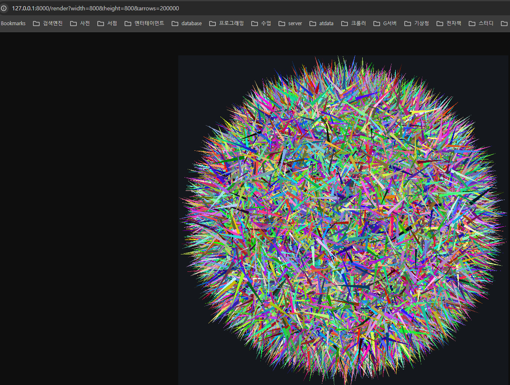

# 🎯 OpenGL Offscreen Vector Renderer (FastAPI)

## 📘 프로젝트 개요
이 서버는 **FastAPI + PyOpenGL + GLFW**를 사용해  
**화면을 띄우지 않고(OpenGL 오프스크린)**  
GPU로 원형 안에 다수의 화살표를 빠르게 렌더링하여  
**PNG 이미지로 HTTP 응답으로 반환**합니다.

---

## 🧩 주요 기능
✅ 클라이언트 요청으로 이미지 크기(`width`, `height`)와 화살표 개수(`arrows`) 지정  
✅ 10만~20만 개 이상의 화살표도 빠르게 렌더링 (NumPy 벡터화 최적화)  
✅ 화살표마다 **길이·색상 랜덤**  
✅ 난수 시드(`seed`) 파라미터로 동일한 결과 재현 가능  

---

## 🧱 설치 방법

### 1️⃣ Python 3.9 이상 권장  
(3.10 이상이면 `int | None` 문법도 그대로 사용 가능)

### 2️⃣ 가상환경 생성 (선택)
```bash
python -m venv venv
source venv/bin/activate     # macOS/Linux
venv\Scripts\activate        # Windows


pip install -r requirements.txt
```

### ️ 실행 방법
```
 gl3.py 를 실행이후 
 http://127.0.0.1:8000/render?width=800&height=800&arrows=200000
```

### 윈도우에서의 TEST
```commandline
PS> curl.exe -o NUL -s -w "%{time_total}\n" "http://127.0.0.1:8000/render?width=800&height=800&arrows=200000"
0.119874
```

### ️ 실행 결과 -> (20 만개의 화살표 )



### ️TODO
```
쉐이더를 통한 성능 향샹을 함

``` 


